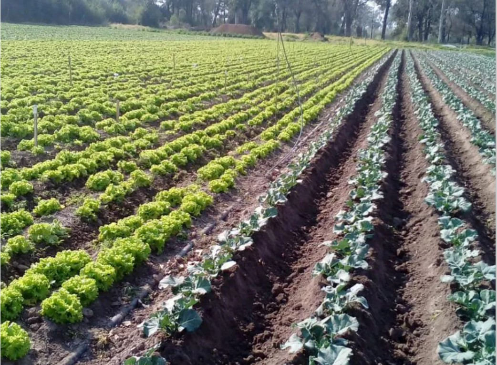

  <h1 style="font-size: 50px;"> Proyecto de Inversión en Explotación Hortícola 🌱💰</h1>

El proyecto tiene como objetivo evaluar la viabilidad económica y financiera de un emprendimiento hortícola en Entre Ríos 🌱, centrado en la producción de hortalizas para satisfacer la demanda local. Se realizó un análisis exhaustivo que incluye estudios de mercado, técnicos y financieros, resultando en un Valor Actual Neto (VAN) de USD 262,785 💰, lo que indica una oportunidad de rentabilidad 📈.

El trabajo en equipo 🤝 fue fundamental para el desarrollo del proyecto, permitiendo a los integrantes combinar sus fortalezas en costeo, presupuestación y análisis financiero. Se llevaron a cabo análisis de sensibilidad y riesgo ⚖️, destacando la importancia de la planificación y el diseño adecuado para maximizar la producción y minimizar la incertidumbre ante fluctuaciones del mercado.

  

